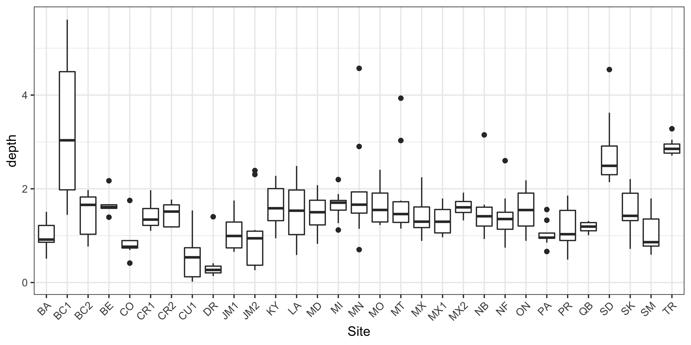

# Population genetics analyses with low-coverage sequence data

After getting analysis-ready BAM files from low-coverage sequencing data, then I make heavy use of the software [ANGSD](http://www.popgen.dk/angsd/index.php/ANGSD) (Analysis of Next Generation Sequencing Data). [ANGSD](http://www.popgen.dk/angsd/index.php/ANGSD) is a software that was specifically developed to analyze low-coverage sequencing data, and notably has many methods designed for accounting for genotype uncertainty. 

One aspect that is different when working with low-coverage data is the file types of the variant information. Typically you don't work with the standard variant call format (VCF) files that are commonplace with called genotypes. Unfortunately, what this means, is you don't have access to all the handy VCF handling software (ex. bcftools) that you may be used to. Fortunately, ANGSD is fairly straightforward with it's ability to produce different file formats for the different analyses needed in the subsequent steps. Just make sure to take note of what file type is needed for the different analyses. For a great tutorial on understanding different analyses and the process of getting the different kinds of genotype likelihood files, check out [lcwgs-guide-tutorial](https://github.com/nt246/lcwgs-guide-tutorial) on github, and their [paper](https://onlinelibrary.wiley.com/doi/10.1111/mec.16077).

The software used here:

- ANGSD (ver 0.939)

- NgsRelate (ver 2)

- NgsLD (ver 1.1.1)

## Identify related individuals

One of the first things I do with the data is to check if I have related individuals that may bias certain subsequent analyses (e.g. population structure). With low-coverage data, [NgsRelate](https://github.com/ANGSD/NgsRelate) is your friend. They provide examples of how to get the necessary genotype likelihood file format of *.glf.gz* from ANGSD, and also produce a file from the allele frequency data that is a single column of allele frequencies.

**Note:** NgsRelate documentation provides example code to remove the header (`sed 1d`) and extract the fifth column (`cut -f5`) from the `mafs.gz` output file from ANGSD to get one of the files needed for NgsRelate input...but like all file manipulation examples it's always good to double-check if the example code still matches the file type needed. For example, I've needed to change the `cut -f` column in the past. So double-check the `.mafs.gz` file to make sure you're doing what's needed, ex. `zcat your_file.mafs.gz | head` to look at the first few lines.\

Unless I have reason to believe individuals from my different sample sites may be related, I tend to speed this analysis up by breaking it into a job array of running NgsRelate for *each* sampling location, thus reducing how many individual pair-wise comparisons there are. This in-turn requires producing a `.glf.gz` file separately for each population/sampling location. So if I get a population glf file (pop1.glf.gz), say with 10 individuals, and the associated allele frequency file (pop1.freq), then all I run is:

```
./ngsrelate -g pop1.glf.gz -n 10 -f pop1.freq -O pop1.relatedness
```

There are many outputs given, and for the American Redstart data, I looked at the *rab pairwise relatedness* from [Hedrick et al. 2015](https://academic.oup.com/jhered/article/106/1/20/2961876) and KING from [Waples et al. 2019](https://onlinelibrary.wiley.com/doi/full/10.1111/mec.14954). I considered related individuals as `KING > 0.08` and `rab > 0.25`. 

## Linkage disequilibrium

I then use the unrelated individuals to determine linkage disequilibrium with [ngsLD](https://github.com/fgvieira/ngsLD). To get this, first you need a filtered beagle file, which I produce from ANGSD:

```
# 325 individuals unrelated all
# thus 50% missing is 163 ind
# average of 1.5x coverage, thus min is 163 * 1.5, max is 2*1.5*325
angsd -b ${input_bams} -out ${outdir}/${outname} -gl 2 -domajorminor 1 \
 -snp_pval 1e-6 -domaf 1 -minmaf 0.05 -doGlf 2 -baq 1 \
 -ref ${reference} -uniqueOnly 1 -remove_bads 1 -only_proper_pairs 1 -trim 0 -C 50 \
  -minMapQ 30 -minQ 33 -minInd 163 -setMinDepth 240 -setMaxDepth 975 -doCounts 1 -nThreads 24
```

Details on filtering can be found on the [ANGSD site](http://www.popgen.dk/angsd/index.php/Input). Some filtering recommendations for low-coverage data can be found in a batch effects paper by [Lou et al. 2021](https://onlinelibrary.wiley.com/doi/full/10.1111/1755-0998.13559). Above, the `-doGlf 2` gives us the needed Beagle file format `.beagle.gz` for NgsLD and `-domaf 1` provides the allele frequency file (`.mafs.gz`). We still need to modify these to provide NgsLD with a genotype likelihood file (basically a beagle file with no header and the first three columns (position, major allele, minor allele) removed) and a file with the site positions (basically the `.mafs.gz` output with no header, and only keeping the first two columns). File prep details are outlined nicely by [lcwgs-guide-tutorial](https://github.com/nt246/lcwgs-guide-tutorial/blob/main/tutorial3_ld_popstructure/markdowns/ld.md) if you're not comfortable manipulating files in bash.

I found ngsLD to be computationally intensive and provided 1 TB of memory and 24 threads for an analysis of 325 individuals across 8,896,381 SNPs (that's a lot of comparisons). See my example script, [get-ngsLD.sh](./slurm-scripts/get-ngsLD.sh). To keep this computationally feasible, I also only considered pairwise comparisons of SNPs that were <10k bases apart.

Then I used the NgsLD `prune_graph.pl` script to select SNPs from the correlated pairs. I provide an example script of this as well, [get-pruned.sh](./slurm-scripts/get-pruned.sh).

This reduced the data set to 5,898,729 SNPs, cool!

**Note:** From here on, a key feature of ANGSD when running analyses back on the BAM files is to only reference these specific SNPs with the *-sites* and *-rf* parameters. But this can be problematic due to some old bugs in ANGSD. The only way I have found to get the *-sites* parameter to work properly is by downloading ANGSD manually (version 0.939, newest for me; NOT through Conda!!!!) and then linking to that download version. It also seems to work best when used with the *-rf* parameter for specifying the chromosomes/scaffolds of interest.

**Another note:** I also sometimes find myself with a list of SNPs and an already prepared Beagle file that I want to subset by the list of SNPs. I could do the step previously mentioned and use "-sites" with ANGSD, but this goes back to the BAM files and is slow and could take days. Another way to quickly subset Beagle files that I like to do is to use an awk command in bash. The magically fast way to do that is:

```
awk 'NR==FNR{c[$1]++;next};c[$1]' ${ld_snps} <(zcat ${input}.beagle.gz) | gzip > ${output}.beagle.gz
```

where `${ld_snps}` is a file with a single column of the `scaffold_position` format of SNP position in the beagle file (i.e. "scaffold"_"position"), and the other input is just your plain old gzipped beagle file. Run this code and then you get a new beagle file that only has the SNPs specified in the snps file. I find this super handy!

## Depth variation and down sampling

I have found that working with different DNA sources such as feathers and blood can result in high variation of sequencing depth. This can then skew different population genetic analyses, especially population structure. Some related issues are addressed in [Lou et al. 2022](https://doi.org/10.1111/1755-0998.13559)




## Principal components analysis

