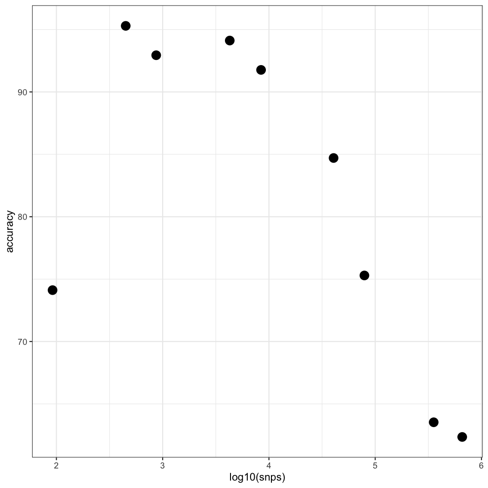

# Population assignment

In order to determine the breeding origin of birds sampled on the nonbreeding range, we need to perform population assignment. To do this, I will go through the following steps:

1.  SNP screening - this involves filtering SNPs by FST to identify a subset that most strongly differentiates between populations determined *a priori* in the previous section

2.  Assignment accuracy with leave-one-out cross validation - this step involves testing those SNPs on a set of breeding individuals that weren't involved in the SNP screening process to avoid ascertainment bias

3.  Nonbreeding assignment - having identified a suitable set of SNPs, we can then assign nonbreeding individuals to breeding populations and report assignment probabilities

To facilitate population assignment from low-coverage data in beagle file format, I have written [https://github.com/mgdesaix/WGSassign](https://github.com/mgdesaix/WGSassign). Check it out for more details!

The software used here:

- ANGSD (ver 0.939)

- WGSassign


## SNP screening

For SNP screening, it is important to identify SNPs associated with population structure from a training set of individuals and then test this on a completely separate set of individuals. Otherwise it is easy to overestimate the accuracy of the SNPs in assigning individuals - this is known as ascertainment bias and details can be found in [Anderson 2010](https://doi.org/10.1111/j.1755-0998.2010.02846.x). To obtain my training set of individuals for the American Redstart data, I split up each sampling site 50:50 into training and testing. This also helped avoid unequal sampling of the sampling sites within the larger population groupings. An example script of how I performed this in R can be found in [snp-screening.Rmd](./other-scripts/snp-screening.Rmd). This resulted in 82 individuals in my training set and 85 individuals in the testing set. The rest of the FST calculations were solely done using the 82 individuals from the training set.

Getting the per-site [FST from ANGSD](http://www.popgen.dk/angsd/index.php/Fst) involves a series of steps:

1.  Get allele frequency file (`-dosaf 1`) for each population (remember to specify `-sites`). An example can be found in the [get-saf.sh](./slurm-scripts/get-saf.sh)

2. Get the 2d site frequency spectrum from each pairwise comparison. 

3. Get the FST using the site allele frequencies and the 2dSFS as a prior. I run the last 2 steps together in the [get-fst.sh](./slurm-scripts/get-fst.sh)

Once I had the per-site FST estimates between each pairwise comparison (10 comparisons), then I created different subsets of SNPs based on pulling the top *x* differentiated SNPs from each of the lists. I created 9 different SNP sets by pulling the top 10, 50, 100, 500, 1000, 5000, 10000, 50000, 100000 SNPs from each of the list. Since there was overlap of SNPs, filtering to the unique number of SNPs resulted in these data sets having 92, 449, 869, 4278, 8429, 40581, 79119,355117, 658724 SNPs, respectively. These file manipulations were done via command line ([get-summarized-files.sh](./slurm-scripts/get-summarized-files.sh)). In the next section I test the accuracy of these different SNP sets.

**Note:** The subset of FST-filtered SNPs is to just be used for assignment. This selection of SNPs is biased toward identifying the population structure we specified with the whole-genome data, and therefore will likely have biases if used for other purposes outside the intended use of this specific population assignment.

## Assignment accuracy with leave-one-out cross validation

So, now we have 9 different sets of SNPs. To determine the best set that represent the population structure we described in American Redstarts, I will now test these SNPs on the testing set of 85 individuals that were *NOT* used in producing them. This is done in [WGSassign](https://github.com/mgdesaix/WGSassign). The `--loo` specification in WGSassign runs leave-one-out cross validation, which removes an individual from the allele frequency calculation for it's known population, then calculates assignment likelihood for that individual to each of the populations, and then moves on to the next individual. The only input for this calculation is the beagle file of the testing individuals (provided to `--beagle`) and a tab-delimited ID file with 2 columns, the first being sample ID and the second being the known reference population. It is **essential** that the sample order in the ID file (row-wise) reflects the sample order in the Beagle file (column-wise); though header sample names in the beagle file don't have to match the first column of the ID file. I do this by just creating a reference file from whatever BAM list I used to create the beagle file.

The main command in WGSassign is shown below (a full example script is provided in [get-loo-WGSassign.sh](./slurm-scripts/get-loo-WGSassign.sh)). 

```
# Get likelihoods for leave-one-out assignment within known reference populations using 20 threads
# Output = 1) reference.popAF.npy, 2) reference.pop_like_LOO.txt
WGSassign --beagle reference.beagle.gz --pop_af_IDs reference_IDS.txt --get_reference_af --loo --out reference --threads 20
```

I then used the file containing the population assignment likelihoods for each individual to determine the overall assignment accuracy of the different SNP sets. I found that using the 449 SNP set (the set obtained from pulling the top 100 from each FST comparison) I achieved maximum assignment accuracy of 95.3%:



For the exact code of how I produced that plot, see [snp-screening.Rmd](./other-scripts/snp-screening.Rmd). I then continued with this SNP set for the nonbreeding assignment

## Nonbreeding assignment

For nonbreeding assignment, I used the numpy binary file of the allele frequencies from the testing individuals as the reference file for assignment (`--pop_af_file ${ref_pop}` below). I then provided a beagle file of just the 148 nonbreeding individuals as input (`--beagle ${nb_beagle}` below). I produced that beagle file by cutting up and subsetting a previous beagle file that had all individuals (see [get-beagle-cut.sh](./slurm-scripts/get-beagle-cut.sh)). The core of the WGSassign code is (the full script is [get-nonbreeding-WGSassign.sh](./slurm-scripts/get-nonbreeding-WGSassign.sh)):

```
WGSassign --beagle ${nb_beagle} --pop_af_file ${ref_pop} --get_pop_like --out ${outname} --threads 20
```

Now, we have population assignment likelihoods for all nonbreeding individuals to each of the 5 genoscape populations, yay!

## Assignment probabilities

To convert the large log likelihoods to assignment probabilities is very straightforward - I do this in R, shown in  [testing-assignment.Rmd](./other-scripts/testing-assignment.Rmd). The gist of it is that you divide the exponentiated likelihood for a given pop by the sum of the exponentiated likelihoods over all 5 pops. If you feel like it, you can also remove a large constant if you're worried by underflow. I then excluded individuals with assignment probabilities of less than 90%, which left me with 128 of the original 148 individuals. 

