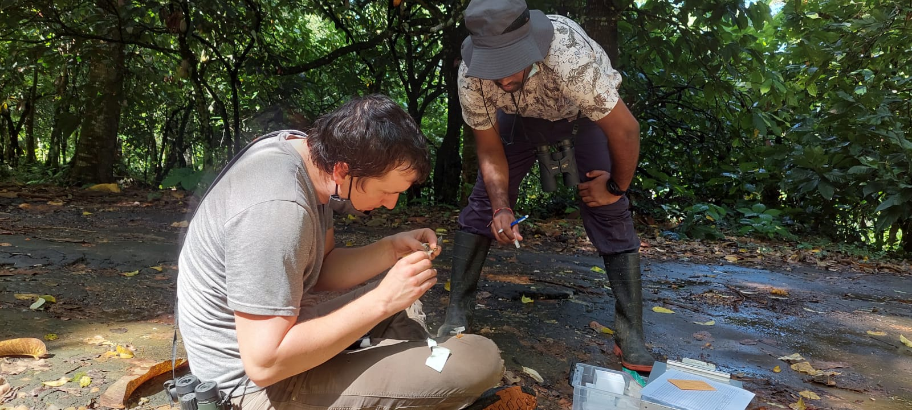

# Local adaptation across the annual cycle: American Redstart

Bioinformatics and analysis scripts for research on local adaptation in American Redstart (*Setophaga ruticilla*) populations across the annual cycle using low-coverage whole genome sequence data. This research builds upon our previous work investigating migratory connectivity in the American Redstart:
[Low-coverage whole genome sequencing for highly accurate population assignment: Mapping migratory connectivity in the American Redstart (Setophaga ruticilla)](https://onlinelibrary.wiley.com/doi/full/10.1111/mec.17137)

See the subsections below for specific details of the analyses:

## 1) Bioinformatics

1.  [Data preprocessing](https://github.com/mgdesaix/amre-adaptation/blob/main/01_Preprocessing/): Producing analysis-ready BAM files from FASTQ files

## 2) Population structure and migratory connectivity

2.  [Population genetics](https://github.com/mgdesaix/amre-adaptation/blob/main/02_PopulationGenetics/): Principal components analysis, relatedness, linkage disequilibrium, ancestry values, and more! Lots of ANGSD (Analysis of Next Generation Sequencing Data)

3.  [Population assignment](https://github.com/mgdesaix/amre-adaptation/blob/main/03_PopulationAssignment/): SNP screening, leave-one-out validation, and assignment probabilities with low-coverage data

## 3) Local adaptation

## Acknowledgements

This study is funded by an NSF CAREER award (008933-00002) to Kristen Ruegg. This work utilized the Alpine high performance computing resource at the University of Colorado Boulder. Alpine is jointly funded by the University of Colorado Boulder, the University of Colorado Anschutz, Colorado State University, and the National Science Foundation (award 2201538).

